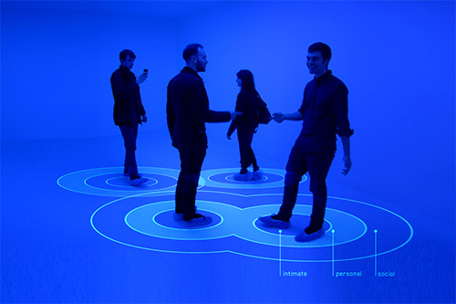
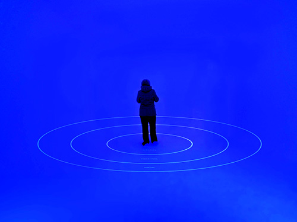
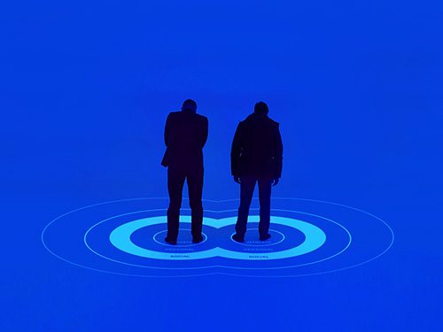
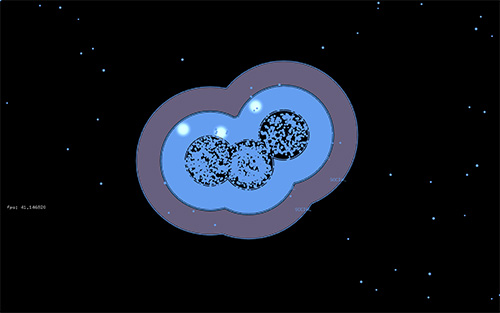
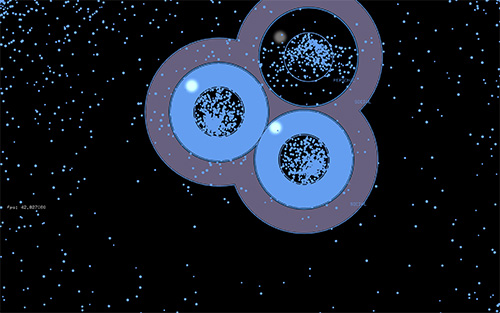

# Personal Space

Can visualizing our invisible boundaries change the way we think about personal space and human interaction?

**How it works**

Interactive installation that tracks people's movements using IR Light and IR Camera, projects their invisible boundaries and other reactive animations.

**Addons used**

* ofxCv
* ofxOpenCv
* ofxBlobsManager
* ofxPennereasing
* ofxFX
* ofxAVFVideoPlayer

