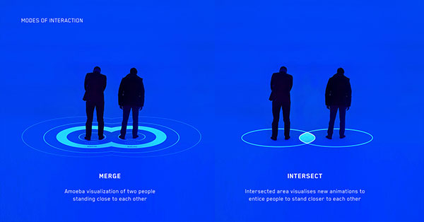
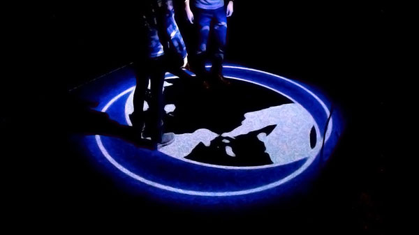
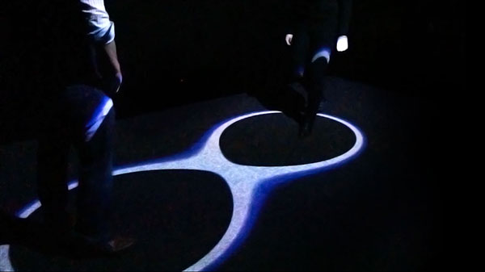
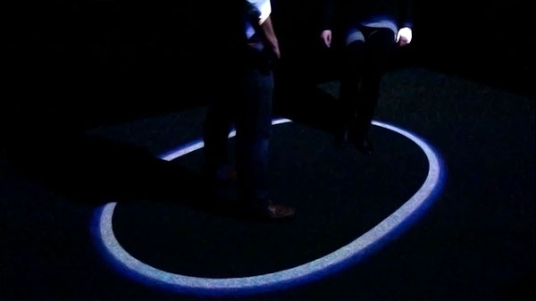

**Personal Space: Visualizing our Invisible Boundaries**

Combined with thesis and building up from the midterm, this project explores the subliminal context of personal space, through an interactive installation set in a public area that witnesses happenstance encounters with strangers. By visualizing our invisible boundaries that are influenced by the presence of others, the goal is to not create separation, but to encourage human interaction. [Video Documentation here](https://vimeo.com/148326277)

**Addons** ofxBlobsManager, ofxCv, ofxOpenCv, ofxPennereasing, ofxPS3EyeGrabber
**Hardware** Hacked PS3EyeCamera, IR Lights, Projector

